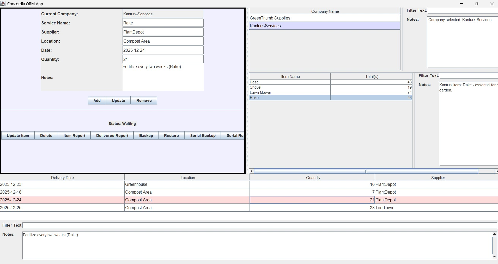
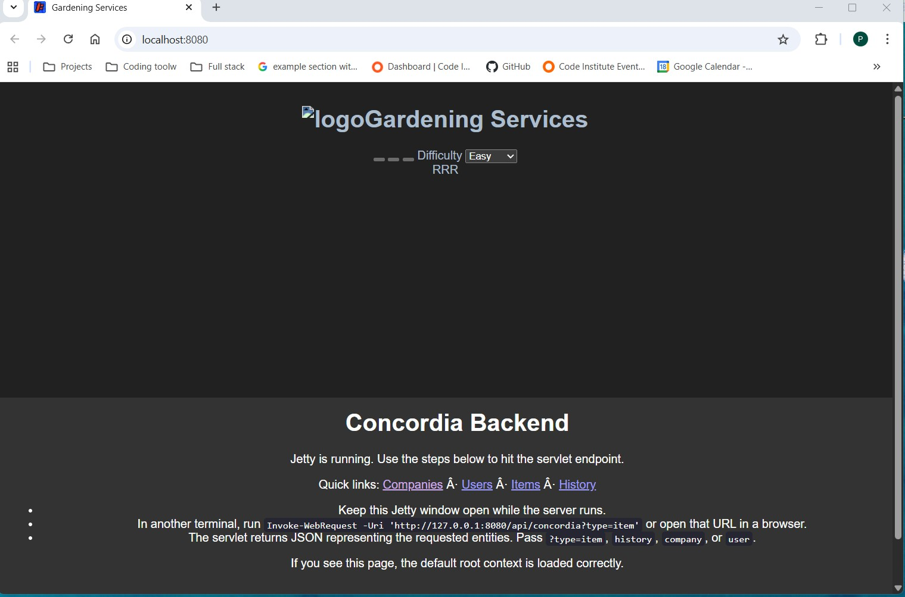

# Concordia

Concordia is a Java application demonstrating the separation of a desktop client from a backend application through an HTTP/JSON interface.

The project began with a database-driven Java Swing application originally created in 2014. In 2026, subsequent to completing the **Code Institute Boot Academy**, the application was revisited and reorganised into a layered client/server architecture.

The Swing desktop application communicates with a Servlet-based backend through HTTP and JSON. The backend is responsible for application logic and persistence, while the Swing client is concerned with the user interface.

This creates a clear separation between:

* the desktop user interface
* the HTTP/API boundary
* application services
* persistence
* the PostgreSQL database

The project also demonstrates how an existing application can be progressively refactored into a more maintainable architecture without having to rewrite the entire application from scratch.

---

## Running Application

### Swing Application

The Swing client can be run as a local desktop application while communicating with the backend through the HTTP/JSON interface.




### Servlet Backend

The Servlet application runs through Jetty and exposes the HTTP/API boundary.





## Architecture


```text
                         Concordia
                             │
                 ┌───────────┴───────────┐
                 │                       │
          Swing Client              HTTP / JSON
                 │                       │
                 │                ConcordiaServlet
                 │                       │
                 │                    Service
                 │                       │
                 │                   Repository
                 │                       │
                 │                      JDBC
                 │                       │
                 └──────────────────── PostgreSQL
```

The principal layers are:

| Layer              | Responsibility                                                    |
| ------------------ | ----------------------------------------------------------------- |
| **UI**             | Java Swing desktop user interface                                 |
| **HTTP Client**    | Sends HTTP requests and receives API responses                    |
| **Servlet**        | Provides the HTTP/API boundary                                    |
| **Controller**     | Translates application requests into service operations           |
| **Service**        | Contains application and business logic                           |
| **Repository**     | Handles persistence and database operations                       |
| **JDBC**           | Provides database connectivity                                    |
| **Domain**         | Represents the application's core data                            |
| **DTOs**           | Objects transferred across the HTTP/API boundary                  |
| **Mappers**        | Convert between domain objects and DTOs                           |
| **Infrastructure** | Application configuration, database connections and object wiring |

The current repository uses a Maven multi-module structure with a shared domain module and separate web and Swing applications.

---

## Project Background

Concordia originated as a Java Swing application created in 2014.

In 2026, after completing the Code Institute Boot Academy, the application was revisited as a software architecture exercise.

The original application was progressively reorganised into layers:

```text
Legacy Swing Application
        │
        ▼
Domain
        │
        ▼
Repository
        │
        ▼
Service
        │
        ▼
Controller
        │
        ▼
HTTP / JSON API
        │
        ▼
Swing HTTP Client
```

The purpose was not simply to modernise the user interface, but to introduce a genuine application boundary between the client and the backend.

The result allows the Swing application and the Servlet application to use the same underlying application/domain concepts while communicating through a defined HTTP/JSON boundary.

---

# HTTP and JSON

The Swing client does not need direct access to the PostgreSQL database.

Instead, it communicates with the backend using HTTP requests.

```text
Swing Client
     │
     │ HTTP request
     ▼
ConcordiaServlet
     │
     ▼
Service
     │
     ▼
Repository
     │
     ▼
JDBC
     │
     ▼
PostgreSQL
```

Responses travel back through the same boundary:

```text
PostgreSQL
     │
     ▼
JDBC
     │
     ▼
Repository
     │
     ▼
Service
     │
     ▼
DTO
     │
     ▼
Jackson ObjectMapper
     │
     ▼
JSON
     │
     ▼
HTTP response
     │
     ▼
Swing Client
```

This creates a hard boundary between the desktop application and the backend.

The Swing client therefore does not need to know:

* how the database is structured
* which SQL statements are used
* how database connections are managed
* how application services are implemented

It only needs to understand the API contract.

---

# JSON Processing

Concordia uses **Jackson** for JSON serialization and deserialization.

Jackson's `ObjectMapper` converts Java DTOs into JSON and converts JSON received from the client back into Java DTOs.

For example:

```json
{
  "id": 1,
  "name": "Example"
}
```

The important distinction is:

```text
Servlet
    │
    └── Handles HTTP requests and responses

Mapper
    │
    └── Converts between domain objects and DTOs

Jackson ObjectMapper
    │
    └── Converts DTOs to/from JSON
```

Jackson is therefore not the Servlet and it is not the application mapper.

The Servlet provides the HTTP boundary, application mappers provide the object-to-object conversion, and Jackson performs JSON serialization and deserialization.

---

# Servlet

`ConcordiaServlet` provides the web/API entry point.

It extends Java's `HttpServlet` and is responsible for receiving HTTP requests and producing HTTP responses.

The Servlet is deliberately kept thin. It does not contain the application's database implementation or the majority of the business logic.

Conceptually:

```text
HTTP Request
     │
     ▼
Jetty
     │
     ▼
ConcordiaServlet
     │
     ▼
Service
     │
     ▼
Repository
```

The current implementation uses an `ObjectMapper` together with repository/service components behind the Servlet boundary.

---

# Jetty

**Eclipse Jetty** provides the Servlet container and web server used to run the backend.

The repository includes Jetty configuration and startup scripts, allowing the Servlet application to run without requiring a separately installed full application server.

Conceptually:

```text
HTTP
 │
 ▼
Jetty
 │
 ▼
ConcordiaServlet
 │
 ▼
Application
```

The project contains PowerShell, batch and shell startup scripts for the Jetty environment.

---

# JDBC and PostgreSQL

The persistence layer communicates with PostgreSQL using JDBC.

```text
Repository
     │
     ▼
   JDBC
     │
     ▼
PostgreSQL
```

The repository layer is responsible for database operations, while the service layer keeps application logic separate from persistence concerns.

This means that the application can perform database operations without requiring an ORM for its core JDBC repository implementation.

The repository contains PostgreSQL configuration and schema documentation, including the `company`, `item`, `users` and `history` tables.

---

# Domain, DTOs and Mappers

The application separates its internal domain model from objects exposed through the API.

DTOs are used to transfer data across the HTTP boundary.

Mappers provide the conversion between domain objects and DTOs.

The general backend flow is:

```text
Database row
     │
     ▼
Repository / JDBC
     │
     ▼
Domain object
     │
     ▼
Mapper
     │
     ▼
DTO
     │
     ▼
Jackson
     │
     ▼
JSON
```

On the client side the process is reversed:

```text
JSON
     │
     ▼
Jackson
     │
     ▼
DTO
     │
     ▼
Mapper
     │
     ▼
Domain object
     │
     ▼
Swing UI
```

This prevents the Swing UI from becoming directly dependent on database implementation details.

---

# Client / Server Separation

One of the main purposes of Concordia is to demonstrate that the Swing user interface does not need to know how data is stored.

```text
┌──────────────────────┐
│     Swing Client     │
└──────────┬───────────┘
           │
        HTTP/JSON
           │
┌──────────▼───────────┐
│   ConcordiaServlet   │
└──────────┬───────────┘
           │
        Services
           │
      Repositories
           │
          JDBC
           │
┌──────────▼───────────┐
│      PostgreSQL      │
└──────────────────────┘
```

The Swing client is divided conceptually into:

```text
swing-client/
├── ui/
├── http/
└── dto/
```

The backend is organised into:

```text
backend/
├── controller/
├── service/
├── repository/
├── domain/
├── dto/
└── infrastructure/
```

The HTTP client builds requests, handles HTTP status codes and converts JSON responses into DTOs.

The backend Servlet acts as the API boundary and delegates application operations to the appropriate layers.

---

# API

Concordia currently uses a common endpoint:

```text
/api/concordia
```

The operation is selected using the `type` query parameter.

## GET

Retrieve resources:

```http
GET /api/concordia?type=item
GET /api/concordia?type=history
GET /api/concordia?type=company
GET /api/concordia?type=user
```

The available resource types currently documented by the client are:

| Type      | Purpose         |
| --------- | --------------- |
| `item`    | Item data       |
| `history` | History records |
| `company` | Company data    |
| `user`    | User data       |

The Swing client uses these GET requests to retrieve data from the backend.

---

## POST

Create resources:

```http
POST /api/concordia?type=item
POST /api/concordia?type=history
```

The request body contains JSON representing the resource being created.

Example:

```json
{
  "companyId": 1,
  "quantity": 10,
  "itemName": "Example Item",
  "location": "Warehouse",
  "notes": "Example notes"
}
```

The exact DTO fields should match the corresponding DTO class in the application.

---

## PUT

Update resources:

```http
PUT /api/concordia?type=item
PUT /api/concordia?type=history
```

The request body contains the JSON representation of the resource being updated.

Example:

```json
{
  "id": 1,
  "companyId": 1,
  "quantity": 20,
  "itemName": "Updated Item"
}
```

---

## DELETE

Delete resources:

```http
DELETE /api/concordia?type=item&id=1
DELETE /api/concordia?type=history&id=1
```

The resource ID is supplied as a query parameter.

The client therefore uses the same API boundary for CRUD operations:

```text
GET     → retrieve
POST    → create
PUT     → update
DELETE  → delete
```

The current repository documents these operations as the HTTP contract used by the Swing client.

---

# API Request Flow

A typical request follows this path:

```text
User interaction
      │
      ▼
Swing UI
      │
      ▼
HTTP Client
      │
      │ JSON / HTTP
      ▼
ConcordiaServlet
      │
      ▼
Controller
      │
      ▼
Service
      │
      ▼
Repository
      │
      ▼
JDBC
      │
      ▼
PostgreSQL
```

The response follows the reverse path:

```text
PostgreSQL
      │
      ▼
JDBC
      │
      ▼
Repository
      │
      ▼
Service
      │
      ▼
Domain
      │
      ▼
Mapper
      │
      ▼
DTO
      │
      ▼
Jackson
      │
      ▼
JSON
      │
      ▼
HTTP Response
      │
      ▼
Swing HTTP Client
      │
      ▼
Swing UI
```

---

# Project Structure

The project is organised as a Maven multi-module application.

```text
Concordia/
│
├── pom.xml
│
├── Shared-Domain/
│   └── ...
│
├── web-app/
│   └── ...
│
├── swing-app/
│   └── ...
│
├── documentation/
│   └── images/
│
├── resources/
│
├── scripts/
│
├── standalone-db-init/
│
├── jetty-base/
│
├── webapps/
│
├── start-jetty.ps1
├── start-jetty.bat
├── start-jetty.sh
│
├── run-swing-app.ps1
├── run-swing-app.bat
│
└── README.md
```

The top-level Maven POM defines three modules:

```text
Shared-Domain
web-app
swing-app
```

The parent project currently targets Java 17.

---

# Technology

* **Java 17**
* **Java Swing**
* **Java Servlet API**
* **Jetty**
* **Jackson**
* **JDBC**
* **PostgreSQL**
* **Maven**
* **JUnit / automated testing**
* **JPA / Hibernate** — included in the later ORM development work

The core client/server architecture remains based on HTTP, Servlets, DTOs, JSON, services and JDBC repositories.

---

# Running the Project

## Prerequisites

Install:

* Java 17
* Maven
* PostgreSQL

The project currently targets Java 17 in its Maven configuration.

---

## 1. Clone the repository

```bash
git clone https://github.com/pio-o-connell/Concordia.git
cd Concordia
```

---

## 2. Build the complete project

```bash
mvn clean install
```

This builds the Maven modules, including the shared domain, backend and Swing application.

---

## 3. Build the Swing application

```bash
mvn package -pl swing-app -am
```

The `-pl swing-app` option selects the Swing module.

The `-am` option also builds modules required by the Swing application.

---

## 4. Run the Swing application

The repository currently provides:

```bash
mvn exec:java -pl swing-app -Dexec.mainClass=concordia.ORMLauncher
```

Alternatively:

```bash
mvn -f swing-app/pom.xml "-Dexec.mainClass=concordia.ORMLauncher" exec:java
```

A project script is also available:

```text
run-swing-app.ps1
```

The repository's current instructions use `concordia.ORMLauncher` as the Swing entry point.

---

## 5. Start the Servlet backend

From the project root:

```powershell
./start-jetty.ps1
```

Equivalent startup scripts are also provided for Windows batch and Unix-like environments:

```text
start-jetty.bat
start-jetty.ps1
start-jetty.sh
```

The Servlet backend runs inside Jetty.

---

# Running Application

## Swing Application

The Swing client can be run as a local desktop application while communicating with the backend through the HTTP/JSON interface.


## Servlet Backend

The Servlet application runs through Jetty and exposes the HTTP/API boundary.


---

# Database Setup

Concordia uses PostgreSQL.

The expected development configuration is:

```text
Host:     localhost
Port:     5432
Database: concordia
User:     postgres
Password: <your PostgreSQL password>
```

The repository contains database initialisation material under:

```text
standalone-db-init/
```

and database configuration used by the web application.

The repository documentation also provides the following PostgreSQL connection example:

```bash
psql -U postgres -h 127.0.0.1 -p 5432 -d concordia
```

### Database tables

The current database model includes:

```text
company
item
users
history
```

with relationships between the tables, including `item` records belonging to companies and history records referencing items.

### Database credentials

Database passwords should **not** be committed to the repository.

The application supports runtime database configuration through environment variables for the web application.

Example:

```powershell
$env:CONCORDIA_DB_URL = "jdbc:postgresql://127.0.0.1:5432/concordia"
$env:CONCORDIA_DB_USER = "postgres"
$env:CONCORDIA_DB_PASSWORD = "<your-password>"

./start-jetty.ps1
```

The repository documents these runtime overrides so that credentials can be supplied without placing them directly into source control.

---

# Development and Refactoring Approach

The project was developed progressively rather than attempting a complete rewrite.

The main stages were:

### 1. Domain first

The application's domain objects were identified and separated from the user interface.

### 2. Repository extraction

Database operations were moved into repository classes.

```text
UI
 ↓
Repository
 ↓
JDBC
 ↓
PostgreSQL
```

### 3. Service layer

A service layer was introduced to separate application logic from persistence.

```text
UI
 ↓
Service
 ↓
Repository
 ↓
JDBC
```

### 4. Controller layer

Controllers were introduced as adapters between the UI/API boundary and the service layer.

### 5. UI simplification

The Swing UI was progressively separated from database and application logic.

The intended UI responsibility became:

* read user input
* display information
* respond to events
* call controllers or HTTP clients

The UI should not contain SQL or database implementation details.

### 6. Infrastructure

Application bootstrapping and object wiring were centralised in infrastructure code.

### 7. Client/server separation

The final architectural step introduced the Servlet as a hard HTTP boundary between the Swing application and backend.

These stages are documented in the repository's development history.

---

# Design Goals

Concordia demonstrates:

* Separation of concerns
* Layered architecture
* Client/server architecture
* Repository pattern
* Service layer
* DTOs
* Object mapping
* HTTP communication
* JSON serialization/deserialization
* Servlet-based APIs
* JDBC database access
* PostgreSQL persistence
* Maven multi-module projects
* Desktop/client separation
* Progressive refactoring of legacy code
* Automated testing
* Runtime configuration

---

# Testing

The project includes tests for the shared domain model.

The repository documentation records tests for:

* Company
* Item
* History
* User

The Maven multi-module structure allows the shared domain code to be built and tested independently from the Swing and web applications.

Further automated testing of the HTTP boundary and integration between the client and backend remains an area for development.

---

# ORM Development

The project also contains work exploring JPA and Hibernate as a possible evolution of the persistence layer.

The intended architecture is:

```text
Application
     │
     ▼
JPA
     │
     ▼
Hibernate
     │
     ▼
JDBC
     │
     ▼
PostgreSQL
```

This is treated as a later development direction rather than a requirement for the core Servlet/JDBC architecture.

The repository contains JPA configuration and Hibernate dependencies associated with this development stage.

---

# Future Improvements

Possible future improvements include:

* [x] Document the main API endpoints
* [x] Add API request examples
* [x] Add screenshots of the Swing application
* [x] Add screenshot of the running Servlet
* [x] Document database configuration
* [x] Document the client/server architecture
* [x] Document the Maven multi-module structure
* [x] Document the development/refactoring approach
* [x] Add automated domain tests
* [ ] Add comprehensive API response examples
* [ ] Add API error-response documentation
* [ ] Add HTTP integration tests
* [ ] Add more automated tests
* [ ] Improve configuration management
* [ ] Add authentication/authorisation
* [ ] Expand API documentation
* [ ] Complete evaluation of JPA/Hibernate against the JDBC implementation
* [ ] Package the application for easier deployment
* [ ] Provide a simplified one-command development startup

---

# What the Project Demonstrates

The central architectural idea can be summarised as:

```text
                    CONCORDIA

             ┌──────────────────┐
             │   Swing Client   │
             └────────┬─────────┘
                      │
                  HTTP / JSON
                      │
             ┌────────▼─────────┐
             │ ConcordiaServlet │
             └────────┬─────────┘
                      │
                   Service
                      │
                 Repository
                      │
                    JDBC
                      │
             ┌────────▼─────────┐
             │    PostgreSQL    │
             └──────────────────┘
```

The important boundary is:

**Swing ↔ HTTP/JSON ↔ Servlet**

Everything behind that boundary belongs to the backend.

This allows the desktop client and backend to evolve independently, provided that the API contract remains compatible.

---

# Author

**Pio O'Connell**

GitHub: [pio-o-connell](https://github.com/pio-o-connell)

---

## Project History

**Original application:** 2014 Java Swing application

**Reorganisation and development:** 2026

**Context:** Developed and substantially reorganised subsequent to completing the Code Institute Boot Academy.

The project demonstrates the progressive transformation of an older database-backed desktop application into a layered client/server Java application with a defined HTTP/JSON boundary.
